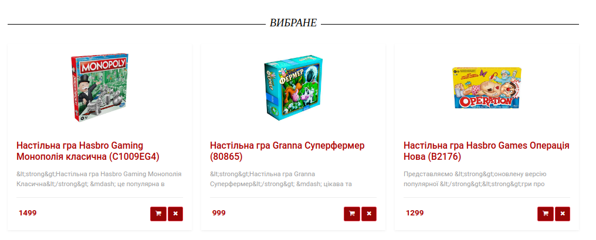

# Конфигурации:
### - NGINX
### - SWOOLE
### - MYSQL
### - PHPMYADMIN
### - REDIS

Для запуска контейнера необходимо раскомментировать нужные и выполнить:
docker-compose up --build ('--build' необходим при первом запуске)

## NGINX

### Docker-compose:

    web:
       build: ./nginx
       container_name: learn_nginx
       volumes:
         - ./www:/usr/share/nginx/html
       restart: unless-stopped
       ports:
         - "80:80"
       environment:
         - NGINX_HOST=localhost
         - NGINX_PORT=80
         - opcache.enable=1
         - opcache.memory_consumption=128
         - opcache.interned_strings_buffer=8
         - opcache.max_accelerated_files=4000
         - opcache.revalidate_freq=60
         - opcache.enable_cli=1
         - php.xdebug.max_nesting_level=500
         - PHP_IDE_CONFIG=serverName=Docker
         - XDEBUG_MODE=debug,develop
       networks:
         - mynetwork
    learn_mysql:
       build: ./mysql
       container_name: learn_mysql
       environment:
         MYSQL_ROOT_PASSWORD: masterkey
         MYSQL_DATABASE: learn_mysql
       restart: unless-stopped
       ports:
         - "3282:3306"
       volumes:
         - learn-db:/var/lib/mysql
       networks:
         - mynetwork

### Dockerfile:

    FROM webdevops/php-nginx:8.1-alpine
    COPY nginx.conf /etc/nginx/nginx.conf

nginx.conf - содержит настройки для изменения

http://['Ваш ip']:8082/

http://localhost:8082/

## SWOOLE

### Docker-compose:

    swoole:
       image: openswoole/swoole
       container_name: learn_swoole
       environment:
         DISABLE_DEFAULT_SERVER: 1
       ports:
         - 8084:9501
       volumes:
         - ./swoole:/var/www
       networks:
         - mynetwork
       command: php server.php

## MYSQL & PHPMYADMIN

### Docker-compose:

    learn_mysql:
      build: ./mysql
      container_name: learn_mysql
      environment:
        MYSQL_ROOT_PASSWORD: masterkey
        MYSQL_DATABASE: learn_mysql
      ports:
        - "3282:3306"
      volumes:
        - learn-db:/var/lib/mysql
    phpmyadmin:
      image: phpmyadmin/phpmyadmin:latest
      restart: always
      ports:
        - '8088:80'
      environment:
        PMA_ARBITRARY: 0
        PMA_HOST: 'learn_mysql'
        MYSQL_ROOT_PASSWORD: 'masterkey'
      depends_on:
        - learn_mysql

### Dockerfile:

    FROM mysql:8.0.31
    COPY ./my.cnf /etc/mysql/my.cnf

mycnf - содержит настройки для изменения

http://['Ваш ip']:8088/

http://localhost:8088/ - PHPMYADMIN

LOGIN: root

PASSWORD: masterkey

### MYSQL

host: ['Ваш ip']

port: 3282

LOGIN: root

PASSWORD: masterkey

## REDIS

### Docker-compose:

    redis:
      image: 'redis:alpine'
      ports:
        - '6379:6379'

host: ['Ваш ip']

port: 6379

# Интернет - магазин реализован на платформе Laravel. 

## Стек технологий: PHP 8.2, MYSQL 8, Laravel, Nginx, Swoole

### Основная цель создания интернет - магазина с использованием современных технологий.

Возможности:
1. Используя технологию DDD и simple_html_dom, выполнять парсинг сайтов 
других интернет - магазинов с возможностью загрузки полученных данных используя микросервис swoole
    
        <?php
        include __DIR__ . '/vendor/autoload.php';
        
        use OpenSwoole\Http\Server;
        use OpenSwoole\Http\Request;
        use OpenSwoole\Http\Response;
        
        $server = new OpenSwoole\HTTP\Server("localhost", 9501, OpenSwoole\Server::POOL_MODE, OpenSwoole\Constant::SOCK_TCP);
        $server->on("start", function (Server $server) {
            echo "OpenSwoole http server is started\n";
        });
        $server->on('WorkerStart', function (OpenSwoole\Server $server, int $workerId) {
            echo "Worker {$workerId} started\n";
        });
        $server->on('WorkerStop', function (OpenSwoole\Server $server, int $workerId) {
            echo "Worker {$workerId} stopped\n";
        });
        
        $server->on("request", function (Request $request, Response $response) {
            go(function () use ($request, $response) {
                if ($request->getMethod() == 'POST') {
                    $response->header("Content-Type", "text/json");
                    $response->header("Charset", "UTF-8");
                    $response->end("{'status':'accepted'}");
                    $run = new \Root\Parser\ui\Route();
                    $run->add($request->post);
                } else {
                    $response->status(403);
                    $response->end("{'status':'forbidden'}");
                }
            });
        });

        $server->start();
            public static function run(string $url): bool
            {
            try {
            $object = array();

            echo "Parsing: " . $url . " is start \n";
            // Get main title
            $object['main'] = self::get_title($url);
            echo "Parsing: " . $object['main'] . " title \n";
            // Get categories
            $object['categories'] = self::get_categories($url);
            $count_categories = count($object['categories']);
            echo "Parsing: " . $count_categories . " categories \n";
            // Get products
            $count_element = 0;
            echo "Parsing: " . $count_element . " of " . $count_categories. "\n";

            foreach ($object['categories'] as $value) {
                $object['categories'][$count_element]['products'][] = self::get_products($value);
                $count_element++;
            }

            // End parsing
            echo "Parsing success \n";
            // Save json
            $json = json_encode($object, JSON_UNESCAPED_UNICODE);
            $file = fopen(__DIR__ . "/jsons/" . $object['main'] . ".json", "w");
            fwrite($file, $json);
            fclose($file);
            // Log
            Parser::log($url . " is parsed");

            return true;
        } catch (\Exception $e) {
            Error::log("Error: " . $e->getMessage() . " at line: " . $e->getLine());
            return false;
        }
        }      
Запросы обрабатываются ассинхронно.

      location /swoole {
      proxy_pass       http://localhost:8084;
      proxy_set_header Host      $host;
      proxy_set_header X-Real-IP $remote_addr;
      }
#### 2. обмен данных выполняется с использованием текена;

     public static function getToken(): string
     {
     try {
     $token = DB::table('personal_access_tokens')
     ->where('tokenable_id', '=', Auth::id())
     ->select('token')
     ->get();
               if (count($token) > 0) {
                   $token = $token[0]->token;
               } else {
                   $token = Auth::user()->createToken('API TOKEN')->plainTextToken;
               }
           } catch (Exception $e) {
               $token = Auth::user()->createToken('API TOKEN')->plainTextToken;
           }
           return $token;
     }

        public function store(Request $request): RedirectResponse
        {
        $validated = $request->validate([
        'target' => ['required', 'string', 'max:255', Rule::notIn(['null'])],
        'resource' => ['required', 'string', 'max:255', Rule::notIn(['null'])],
        'url' => ['required', 'string', 'max:255'],
        ]);
        $token = $this->get_token($request);
        try {
        Http::asForm()->post($validated['resource'], [
        'target' => $validated['target'],
        'url' => $validated['url'],
        'token' => $token
        ]);

            return redirect()->route('admin.exchanges.index')->with('status', 'Exchange created successfully!');
        } catch (Exception) {
            return redirect()->route('admin.exchanges.index')->with('error', 'Something went wrong.');
        }

    }

#### 3. Поддерка на 3-х языках;

#### 4. Наличие админ - панели для ручного ввода информации или корректировки текущего пользователя;

возможности:
- поиск по данным пользователя;
- временная блокировка пользователя;
- отправка сообщение на почту пользователю;
- добавить комментарий;
- просмотреть данные пользователя;
- удалить пользователя.
Удаление пользователя выполняется с возможностью восстановления или удалить навсегда.
#### 4. Наличие личного кабинета и возможность осуществлять контроль пользователей;

#### 5. Возможность добавлять товар в список желаний;

#### 6. Вывод товаров на главную категорию через предпочтения пользователей;

#### 7. Возможность добавить клиенту товар в корзину с последующим выбором доставке и оплаты;

Указывается статус и при изменении статуса на вылнено клиенту отправляется код наклодной автоматически
#### 8. Администратор 

Адинистратор может:
- удалить заказ;
- изменить статус;
- распечать заказ.
#### 9. Поиск с помощюь Json
Для поисковой системы был написан плагин, который подойдет для любого сайта
https://github.com/go280286sai/search_json

### 10. Оплата криптовалютой
Выбранный товар можно оплатить криптовалютой используя Metamask кошелек.
Контракт для оплаты в магазине:

    // SPDX-License-Identifier: UNLICENSED
    pragma solidity ^0.8.0;

    contract Shop {
    address payable private owner;
    struct Payment {
        int256 id;
        address from;
        uint256 total;
        int256 time;
    }
    mapping(int256 => Payment) private Payments;

    constructor() {
        owner = payable(msg.sender);
    }

    event ToPay(int256 id, address from, uint256 total, int256 time);

    event ToSend(uint256 total, string target, int256 time);

    modifier Is_owner() {
        require(owner != msg.sender, "Not owner");
        _;
    }

    function pay(int256 id) external payable {
        address from_ = msg.sender;
        uint256 total_ = uint256(msg.value);
        int256 time_ = int256(block.timestamp);
        emit ToPay(int256(id), from_, total_, time_);
        Payment memory newpay = Payment(int256(id), from_, total_, time_);
        Payments[id] = newpay;
    }

    function to_send(uint256 value) public Is_owner {
        emit ToSend(value, "sent many", int256(block.timestamp));
        owner.transfer(value);
    }

    function send_all() public Is_owner {
        uint256 value = uint256(address(this).balance);
        emit ToSend(value, "sent many", int256(block.timestamp));
        owner.transfer(value);
    }

    function transaction(int256 id) public view returns (Payment memory) {
        return Payments[id];
    }

    function balanceOf() public view returns (uint256) {
        return uint256(address(this).balance);
    }

    function backMoney(int256 id) public returns (string memory) {
        require(owner==msg.sender, "forrbiten");
        Payment memory payment = transaction(id);
        uint256 balance_ = balanceOf();
        require(payment.total < balance_, "Not enough money");
        address payable user = payable(payment.from);
        delete Payments[id];
        user.transfer(payment.total);
        return "ok";
    }
  
    }

Есть возможность оплаты за товар, возврат суммы и перевод денег с контракта частично или полностью. Интерфейс оплаты реализован с Vue

Тестирование выполнено на тестовой сети с помощью hardhat.